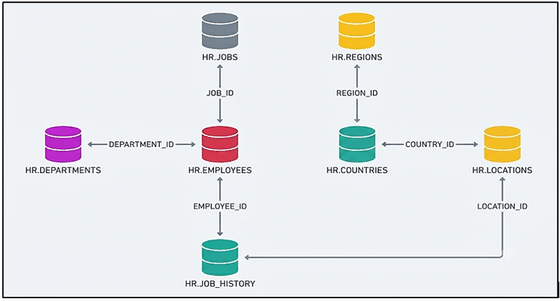
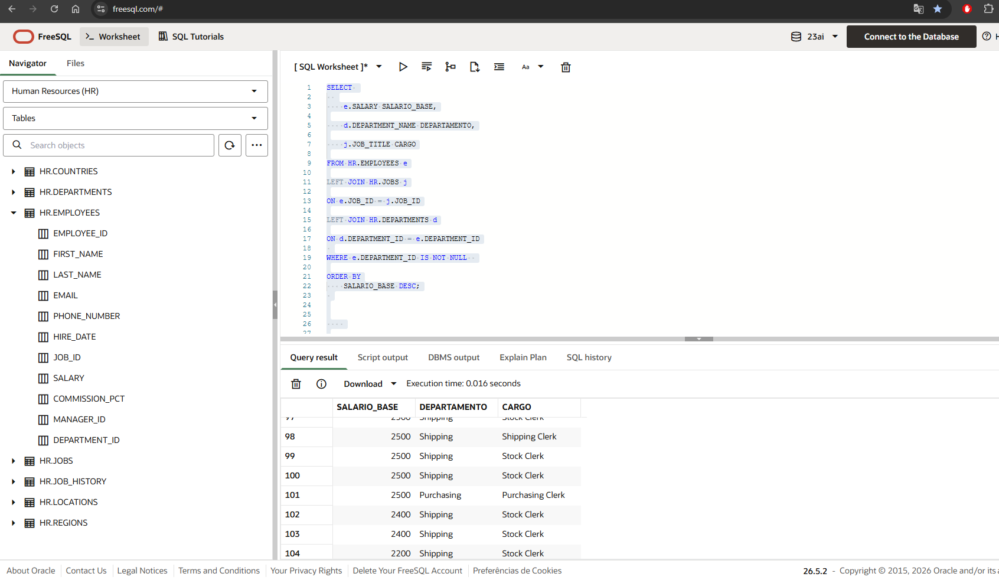
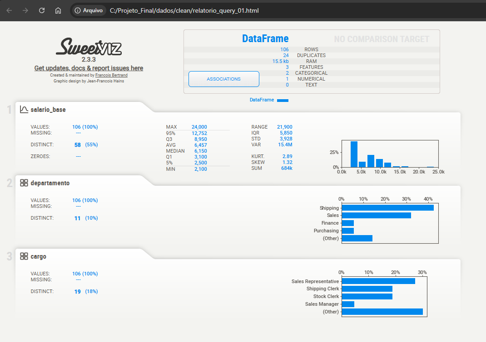
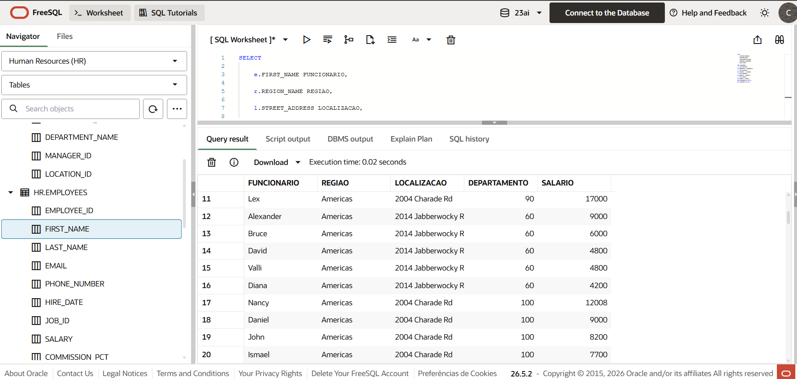
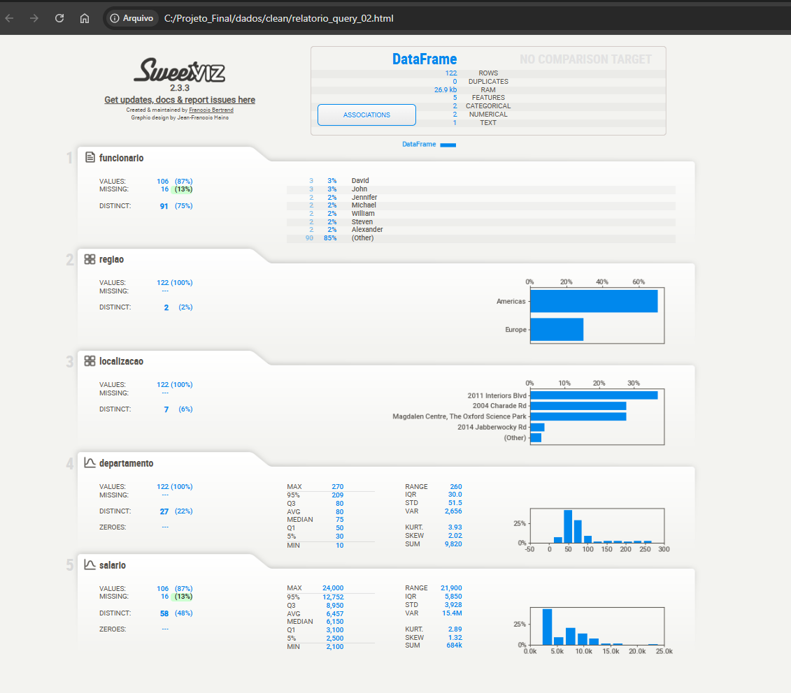
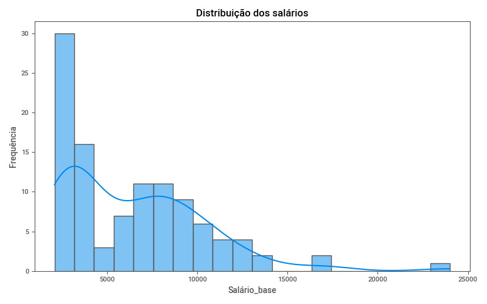
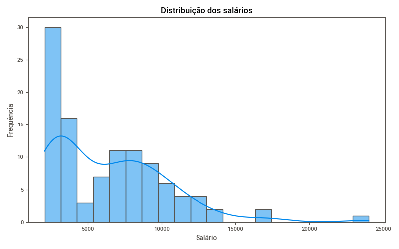
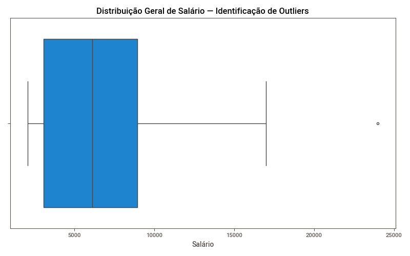
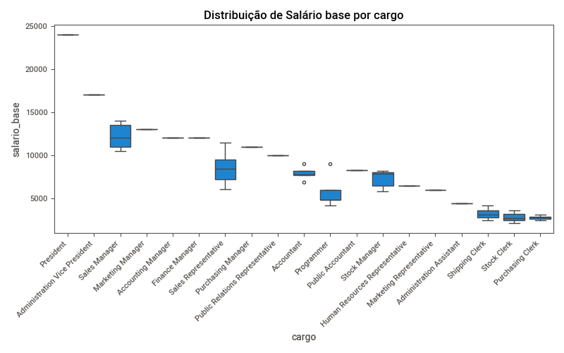
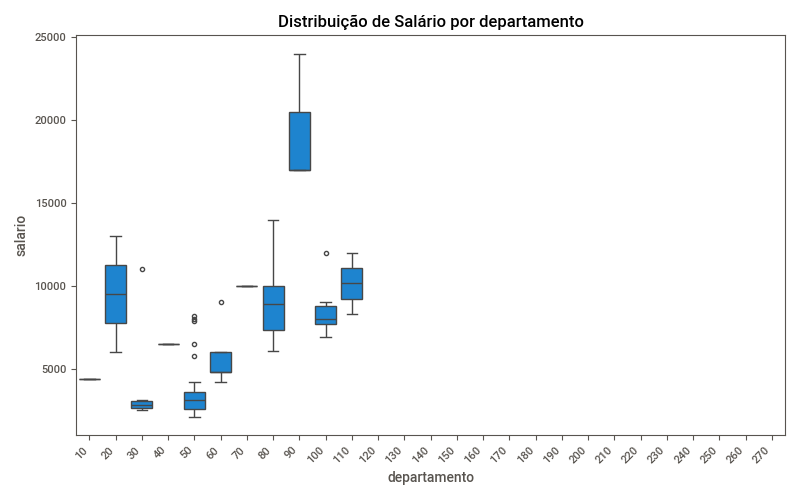

# Projeto Avaliativo: Visualização de Dados e Business Intelligence

**Módulo 1 - Semana 13**

## 👤 Identificação

* **Aluno:** Cláudia Maria Duarte Ramos
* **Turma:** Visualização de Dados e Business Intelligence — T1
* **Mentor:** Rodrigo Garcia Brunini

# Análise de Dados — RH (Human Resources) com FreeSQL, Python e Sweetviz

## 🎯 Objetivo

Atuar na posição de analista de dados para estudar os dados do esquema de Recursos Humanos (HR) do FreeSQL, identificando padrões salariais, concentração de funcionários por departamento, cargo e região, e detectando discrepâncias (outliers) que possam apoiar decisões de gestão corporativa.

## 📋 Contexto / Perguntas de negócio

- Qual departamento concentra mais funcionários?
- Qual departamento possui a maior média salarial?
- Como os funcionários se distribuem por região?
- Qual localização concentra mais departamentos?
- Quem é o funcionário com maior salário? Quais inferências a respeito?
- Onde se concentra a maior parte dos salários da empresa?
- Como o salário varia entre os diferentes cargos?
- Existem outliers salariais? Quais?
- Como a média salarial se compara entre regiões?

## 🛠️ Ferramentas Utilizadas

| Ferramenta | Utilização |
|---|---|
| **Python** | Linguagem de programação utilizada para tratamento, análise e manipulação dos dados do projeto |
| **FreeSQL** | Ambiente online para execução e validação de consultas SQL, sem necessidade de instalação local de banco de dados |
| **VS Code** | Editor de código utilizado para desenvolvimento dos scripts, documentação e organização da estrutura do projeto |
| **Pandas** | Manipulação, limpeza e agregação dos dados tabulares |
| **Seaborn / Matplotlib** | Criação de gráficos estatísticos (histograma, boxplot) para visualização e análise exploratória |
| **CSV** | Formato de arquivo utilizado para armazenamento e importação dos dados tabulares do projeto |
| **Sweetviz** | Biblioteca Python utilizada para geração automatizada de relatórios de Análise Exploratória de Dados (EDA) |
| **GitHub** | Plataforma de versionamento utilizada para controle de código-fonte, documentação e histórico de desenvolvimento do projeto |

## ▶️ Como executar

**Versão do Python:** 3.11.9

**Ambiente virtual:** não utilizado — bibliotecas instaladas diretamente no Python 3.11 global.

```bash
pip install pandas seaborn matplotlib sweetviz
python script_ava_final.py
```

## 📁 Estrutura do projeto

```
Projeto_Final/
├── README.md
├── script_ava_final.py
├── Queries/
│   ├── query_01.csv
│   ├── query_02.csv
│   └── codigos_consultas.sql
├── dados/
│   └── clean/
│       ├── query_01_outliers.csv
│       ├── query_01_sem_outliers.csv
│       ├── query_02_outliers.csv
│       ├── query_02_sem_outliers.csv
│       ├── relatorio_query_01.html
│       └── relatorio_query_02.html
├── docs/
│   └── (materiais de apoio do projeto)
└── assets/
    ├── projeto_final_schema.png
    ├── FreeSQL_query_01.png
    ├── FreeSQL_query_02.png
    ├── Sweetviz_query_01.png
    ├── Sweetviz_query_02.png
    ├── Figure_1_BOXPLOT_GERAL_query_01.png
    ├── Figure_2_BOXPLOT_GERAL_query_02.png
    ├── Figure_3_HISTOGRAMA_query_01.png
    ├── Figure_4_HISTOGRAMA_query_02.png
    ├── Figure_5_BOXPLOT_query_01.png
    ├── Figure_6_BOXPLOT_query_02.png
    └── boxplot_outliers.png
```

## 📁 Modelo do banco (schema HR)



Estrutura relacional utilizada: `EMPLOYEES` como tabela central, relacionada a `DEPARTMENTS`, `JOBS`, `JOB_HISTORY`, e a cadeia geográfica `LOCATIONS → COUNTRIES → REGIONS`.

## 🔄 Etapas aplicadas

1. Consulta ao schema **HR** no FreeSQL — duas queries elaboradas
2. Exportação dos resultados em `.csv` (`query_01.csv` e `query_02.csv`)
3. Leitura dos dois CSVs em Python (`pandas`)
4. Padronização dos nomes de coluna (minúsculo, sem espaços)
5. Diagnóstico inicial de integridade (nulos, duplicatas, tipos de dado) — para as duas queries
6. Geração de relatórios automáticos de EDA (Sweetviz) — um para cada query
7. Análises de negócio direcionadas (9 perguntas, cruzando as duas fontes)
8. Cálculo de estatísticas descritivas (por departamento, por cargo e por região)
9. Identificação e exportação de outliers (método IQR) — para as duas queries
10. Geração de gráficos (histograma e boxplots) — para as duas queries
11. Documentação dos achados neste README

## 🔍 Query 1 — Salário, Departamento e Cargo



```sql
SELECT
    e.SALARY SALARIO_BASE,
    d.DEPARTMENT_NAME DEPARTAMENTO,
    j.JOB_TITLE CARGO
FROM HR.EMPLOYEES e
LEFT JOIN HR.JOBS j ON e.JOB_ID = j.JOB_ID
LEFT JOIN HR.DEPARTMENTS d ON d.DEPARTMENT_ID = e.DEPARTMENT_ID
WHERE e.DEPARTMENT_ID IS NOT NULL
ORDER BY SALARIO_BASE DESC;
```

📄 Código completo disponível em [`Queries/codigos_consultas.sql`](Queries/codigos_consultas.sql)

**106 registros, 3 colunas.** Diferente da Query 2, aqui o `DEPARTAMENTO` já vem com o **nome real** (não o código) — cada linha é um funcionário com seu cargo e departamento nomeado.

### Relatório Sweetviz — Query 1


🔗 [Relatório interativo completo](https://htmlpreview.github.io/?https://raw.githubusercontent.com/ClaudiaRamos-Git/PROJETO_FINAL/main/dados/clean/relatorio_query_01.html)

| Métrica | Valor |
|---|---|
| Registros | 106 |
| Duplicatas | 24 |
| Valores ausentes | 0 |
| Departamentos distintos | 11 (Shipping, Sales, Finance, Purchasing entre os mais frequentes) |
| Cargos distintos | 19 |

> ✏️ *As 24 duplicatas não são erro de dado: a consulta não inclui nome/ID do funcionário, então funcionários diferentes com o mesmo salário, departamento e cargo (comum entre cargos operacionais, como "Stock Clerk") geram linhas idênticas.*

## 🔍 Query 2 — Funcionário, Região, Localização e Departamento



```sql
SELECT
    e.FIRST_NAME FUNCIONARIO,
    r.REGION_NAME REGIAO,
    l.STREET_ADDRESS LOCALIZACAO,
    d.DEPARTMENT_ID DEPARTAMENTO,
    e.SALARY SALARIO
FROM HR.DEPARTMENTS d
LEFT JOIN HR.EMPLOYEES e ON e.DEPARTMENT_ID = d.DEPARTMENT_ID
LEFT JOIN HR.LOCATIONS l ON d.LOCATION_ID = l.LOCATION_ID
LEFT JOIN HR.COUNTRIES c ON l.COUNTRY_ID = c.COUNTRY_ID
LEFT JOIN HR.REGIONS r ON r.REGION_ID = c.REGION_ID
WHERE d.DEPARTMENT_ID IS NOT NULL
  AND r.REGION_NAME IS NOT NULL;
```

📄 Código completo disponível em [`Queries/codigos_consultas.sql`](Queries/codigos_consultas.sql) *(inclui também a versão sem filtro, para comparação)*

**122 registros, 5 colunas.** Aqui `DEPARTAMENTO` é o **código numérico**, e a consulta parte de `DEPARTMENTS`, não de `EMPLOYEES` — por isso departamentos sem nenhum funcionário vinculado também aparecem (ver Achado 2).

### Relatório Sweetviz — Query 2


🔗 [Relatório interativo completo](https://htmlpreview.github.io/?https://raw.githubusercontent.com/ClaudiaRamos-Git/PROJETO_FINAL/main/dados/clean/relatorio_query_02.html)

| Métrica | Valor |
|---|---|
| Registros | 122 |
| Duplicatas | 0 |
| Valores ausentes — `funcionario` / `salario` | 16 (13%) cada |
| Regiões distintas | 2 (Americas, Europe) |
| Localizações distintas | 7 |
| Departamentos distintos (código) | 27 |

> ⚠️ *Os links acima só funcionam depois do `git push` que inclui a pasta `dados/` (ver seção de commits no processo de versionamento).*

## 📊 Análises de negócio realizadas

| # | Análise | Resultado | Fonte |
|---|---|---|---|
| 1 | Funcionários por departamento | Departamento **50** lidera com **45** funcionários, seguido do **80** com **34** | Query 2 |
| 2 | Departamento com maior média salarial | **Executive** — média de **R$ 19.333,33** | Query 1 |
| 3 | Concentração de funcionários por região | **Americas: 70** · **Europe: 36** | Query 2 |
| 4 | Localização com mais departamentos | **2004 Charade Rd**, concentrando **21** departamentos | Query 2 |
| 5 | Funcionário com maior salário | **Steven**, departamento 90, região Americas — **R$ 24.000,00** | Query 2 |
| 6 | Onde se concentra a maior parte dos salários | Entre **R$ 3.100,00** (Q1) e **R$ 8.950,00** (Q3) — mediana **R$ 6.150,00** | Query 1 e Query 2 (idêntico) |
| 7 | Média salarial por cargo | **President** lidera (R$ 24.000,00), **Purchasing Clerk** é o menor (R$ 2.780,00) | Query 1 |
| 8 | Presença de outliers | **1 outlier** em cada query: o cargo de President / departamento 90 | Query 1 e Query 2 |
| 9 | Análise regional — média salarial | **Europe: R$ 8.916,67** · **Americas: R$ 5.191,66** | Query 2 |

### Média salarial por cargo (Query 1, ranking completo)

| Cargo | Média Salarial |
|---|---|
| President | R$ 24.000,00 |
| Administration Vice President | R$ 17.000,00 |
| Marketing Manager | R$ 13.000,00 |
| Sales Manager | R$ 12.200,00 |
| Finance Manager | R$ 12.008,00 |
| Accounting Manager | R$ 12.008,00 |
| Purchasing Manager | R$ 11.000,00 |
| Public Relations Representative | R$ 10.000,00 |
| Sales Representative | R$ 8.396,55 |
| Public Accountant | R$ 8.300,00 |
| Accountant | R$ 7.920,00 |
| Stock Manager | R$ 7.280,00 |
| Human Resources Representative | R$ 6.500,00 |
| Marketing Representative | R$ 6.000,00 |
| Programmer | R$ 5.760,00 |
| Administration Assistant | R$ 4.400,00 |
| Shipping Clerk | R$ 3.215,00 |
| Stock Clerk | R$ 2.785,00 |
| Purchasing Clerk | R$ 2.780,00 |

> 📌 *Nota sobre formatação: os valores salariais neste documento estão apresentados no formato monetário brasileiro (R$ 0.000,00) para facilitar a leitura. O script Python original imprime os mesmos valores sem essa formatação (ex: `19333.33`) — a formatação aqui é apenas de exibição; os números são idênticos aos calculados pelo script.*

## 🌟 Achado 1 — o departamento 90 é o Executive (confirmado diretamente pela Query 1)

A Query 2 traz só o código do departamento (90). A Query 1, que já vem com nome, mostra diretamente que **"Executive" é o departamento com maior média salarial: R$ 19.333,33** — o valor exato apurado para o departamento 90 na Query 2. Isso confirma, com as duas fontes concordando, que **departamento 90 = Executive**, e explica por que ele aparece isolado, bem acima dos demais, em todos os boxplots por categoria.

## 🌟 Achado 2 — os 16 valores ausentes, explicados

Os departamentos de código **120 a 270** (16 códigos) aparecem com contagem **zero** de funcionários — exatamente o número de valores ausentes apontado pelo Sweetviz da Query 2. Ou seja: **16 departamentos cadastrados não possuem nenhum funcionário vinculado**, preservados intencionalmente pelo uso de `LEFT JOIN` a partir da tabela `DEPARTMENTS`. Não é erro de dado — é uma decisão de modelagem que permite enxergar a cobertura organizacional completa, incluindo departamentos vazios. Por isso, nas seções de outliers de ambas as queries, o total de registros classificados (outliers + sem outliers) soma **106**, não 122 — os 16 registros sem salário ficam de fora da classificação, e não por erro de cálculo.

## 🌟 Achado 3 — as duas queries descrevem exatamente os mesmos funcionários

O resumo estatístico do salário é **idêntico entre as duas queries até a sexta casa decimal** (média R$ 6.456,75 nas duas, mesmo mínimo, mesmo máximo, mesmos quartis). Isso não é coincidência: confirma que a Query 1 e a Query 2, mesmo com estruturas de `JOIN` diferentes, descrevem exatamente os **mesmos 106 funcionários com dado salarial completo** — é por isso que os histogramas e os boxplots gerais de outliers das duas consultas têm formato idêntico. Essa é uma validação cruzada natural de que as duas consultas SQL foram construídas corretamente sobre a mesma base de dados.

## 🔺 Identificação de Outliers (método IQR)

| Métrica | Query 1 | Query 2 |
|---|---|---|
| Q1 (25%) | R$ 3.100,00 | R$ 3.100,00 |
| Q3 (75%) | R$ 8.950,00 | R$ 8.950,00 |
| IQR | R$ 5.850,00 | R$ 5.850,00 |
| Limite superior | R$ 17.725,00 | R$ 17.725,00 |
| Total de registros | 106 | 122 (106 com salário preenchido) |
| Outliers identificados | 1 — President / Executive | 1 — Steven / depto 90 |
| Registros sem outliers | 105 | 105 |

## 📈 Gráficos

### Distribuição salarial — Histogramas



Os dois histogramas são visualmente idênticos (ver Achado 3): a maior parte dos salários está concentrada entre R$ 2.000,00 e R$ 5.000,00, com frequência caindo progressivamente até R$ 24.000,00 — distribuição assimétrica à direita, coerente com o outlier identificado.

### Boxplot geral — Identificação de Outliers



Confirmação visual do único outlier identificado pelo método IQR em cada query, fora do limite superior de R$ 17.725,00.

### Salário por Cargo (Boxplot) — Query 1


O cargo **President** se destaca isoladamente no topo (R$ 24.000,00), seguido de **Administration Vice President** (R$ 17.000,00). Cargos operacionais (Shipping Clerk, Stock Clerk, Purchasing Clerk) concentram-se na faixa mais baixa, abaixo de R$ 3.500,00.

### Salário por Departamento (Boxplot) — Query 2


O departamento **90 (Executive, confirmado no Achado 1)** se destaca claramente acima dos demais, com salários entre R$ 17.000,00 e R$ 24.000,00. Os demais departamentos concentram-se abaixo de R$ 14.000,00.

## 💡 Principais insights e conclusões

- **O departamento Executive concentra a maior média salarial da empresa** (R$ 19.333,33), confirmado diretamente por nome (Query 1) e por código (Query 2, departamento 90).
- **A região Europe tem média salarial 72% maior que Americas** (R$ 8.916,67 vs R$ 5.191,66), apesar de ter praticamente metade do número de funcionários (36 vs 70).
- **O departamento de código 50 (perfil operacional/Shipping) concentra 42% de toda a força de trabalho** (45 de 106 funcionários).
- **O ranking de cargos por salário reflete uma hierarquia organizacional clara**: da Presidência (R$ 24.000,00) até cargos operacionais de estoque e compras (~R$ 2.780,00–2.785,00) — uma diferença de mais de 8,6x entre o maior e o menor.
- **16 departamentos (13% da base) não possuem nenhum funcionário vinculado** — sinal relevante para gestão de RH sobre estrutura organizacional subutilizada ou em expansão.
- **Um único outlier salarial real** foi identificado estatisticamente em cada query (método IQR), e é o mesmo funcionário/cargo nas duas — plenamente justificável pelo cargo de Presidência.
- **As duas queries se validam mutuamente**: a igualdade estatística exata do salário entre elas confirma que ambas consultam corretamente a mesma base de funcionários, apenas sob perspectivas diferentes (cargo/departamento vs. pessoa/região).

## 🎯 Competências Demonstradas

### Por ferramenta

**Python** — Manipulação e transformação de dados, lógica de programação aplicada à análise, automatização de tratamento.
**FreeSQL** — Modelagem e consulta de banco relacional, escrita de queries SQL (JOIN, WHERE, ORDER BY).
**VS Code** — Uso de ferramentas profissionais de desenvolvimento, organização de projeto.
**Seaborn** — Visualização orientada a análise, escolha do gráfico certo para cada pergunta.
**CSV** — Manipulação de dados tabulares, pipeline de exportação/importação entre sistemas.
**Sweetviz** — Análise Exploratória automatizada, interpretação de relatórios estatísticos.
**GitHub** — Versionamento, documentação técnica, boas práticas de portfólio.

### Competências transversais

- **Pipeline de dados ponta a ponta** — da extração (SQL) ao insight visual (Seaborn/Sweetviz)
- **Pensamento analítico** — cruzamento de duas fontes de dado para confirmar hipóteses e validar consistência (Achados 1 e 3)
- **Debug e validação** — identificação de erros e correção de inconsistências, incluindo:
  - Versão do Python: ajuste para a versão correta do interpretador, evitando incompatibilidades entre bibliotecas
  - Ambiente virtual (venv): ativação e desativação (`deactivate`) quando necessário, garantindo que o script utilizasse as dependências corretas
  - Nomes de variáveis: padronização e correção para evitar erros como `NameError` e facilitar a manutenção do código
  - Validação das métricas: conferência dos cálculos estatísticos (média, mediana, quartis, IQR e outliers) para assegurar que os resultados estavam corretos
  - Arquivos de imagem: validação e ajuste dos nomes dos arquivos gerados (`.png`), corrigindo sobrescrita indevida entre gráficos de queries diferentes
- **Comunicação de dados** — tradução de análise técnica em insight de negócio

---

## Autor

**Cláudia Maria Duarte Ramos**

[](https://www.linkedin.com/in/cl%C3%A1udia-maria-duarte-ramos-17b1151a2/)
[](https://github.com/ClaudiaRamos-Git)